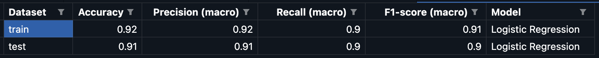
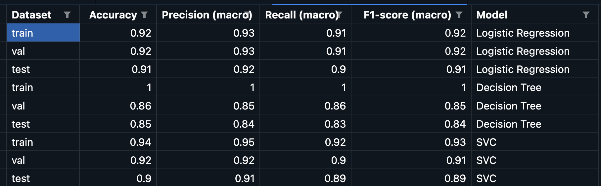

## 📘 Tabela wyników – interpretacja metryk

| Kolumna             | Znaczenie                                                                              |
| ------------------- | -------------------------------------------------------------------------------------- |
| `Dataset`           | Zbiór danych, na którym liczono metryki: `train` (treningowy), `test`                  |
| `Accuracy`          | Procent wszystkich próbek, które zostały poprawnie sklasyfikowane                      |
| `Precision (macro)` | Średnia precyzja dla każdej klasy – ile z przewidzianych „tak” to było prawdziwe „tak” |
| `Recall (macro)`    | Średnia czułość – ile prawdziwych „tak” zostało poprawnie wykrytych                    |
| `F1-score (macro)`  | Średnia harmoniczna precyzji i czułości – równoważy oba wskaźniki                      |
| `Model`             | Nazwa modelu – tutaj: `Logistic Regression` (sklearn vs własna wersja)                 |

## Tabela wyników dla własnej implementacji sklearn ( zadanie 3.0 )

## Tabela wyników dla własnej implementacji regresji logistycznej ( zadanie 4.0 )

## 📊 Porównanie wyników regresji logistycznych

| Dataset   | Metryka           | Sklearn (`zadanie 3.0`) | Własna (`zadanie 4.0`) |
| --------- | ----------------- | ----------------------- | ---------------------- |
| **train** | Accuracy          | 0.92                    | 0.92                   |
|           | Precision (macro) | 0.93                    | 0.92                   |
|           | Recall (macro)    | 0.91                    | 0.90                   |
|           | F1-score (macro)  | 0.92                    | 0.91                   |
| **test**  | Accuracy          | 0.91                    | 0.91                   |
|           | Precision (macro) | 0.92                    | 0.91                   |
|           | Recall (macro)    | 0.90                    | 0.90                   |
|           | F1-score (macro)  | 0.91                    | 0.90                   |

## Wnioski 

Obie wersje modelu dają prawie identyczne wyniki, co oznacza, że  własna implementacja działa bardzo dobrze.

Sklearn jest minimalnie lepszy, co prawdopodobnie wynika z zastosowania:

lepszego optymalizatora 

wbudowanej regularyzacji L2

precyzyjnych tolerancji numerycznych

Różnice ≤ 0.01

## 4.0 1b Przeanalizuj ograniczenia zastosowania zamkniętej formuły. Dlaczego nie jest w praktyce wykorzysytwana?

- Koszt obliczeniowy i pamięciowy
Aby obliczyć,Mnożenie macierzy, operacji, a odwrócenie tej macierzy to 
Gdy masz np. 10 000 cech, odwracanie macierzy wymaga setek miliardów operacji i ogromnej ilości pamięci RAM.

- Brak skalowalności do ogromnych danych
Dla zbiorów o milionach próbek lub dziesiątkach tysięcy cech pojęcie „wszystko w pamięci” się rozpada.

- Prawdziwe aplikacje uczą modele na strumieniach danych lub w mini‐batchach, co zamknięta formuła uniemożliwia.

-  Tylko regresja liniowa
Zamknięta formuła zadziała jedynie dla regresji z MSE (błędem kwadratowym) i modelu liniowego.

- Nie zastosujesz jej do:
- regresji logistycznej (cross‐entropy)
- sieci neuronowych
- innych funkcji kosztu, które nie dają się sprowadzić do odwrócenia jednej macierzy.
